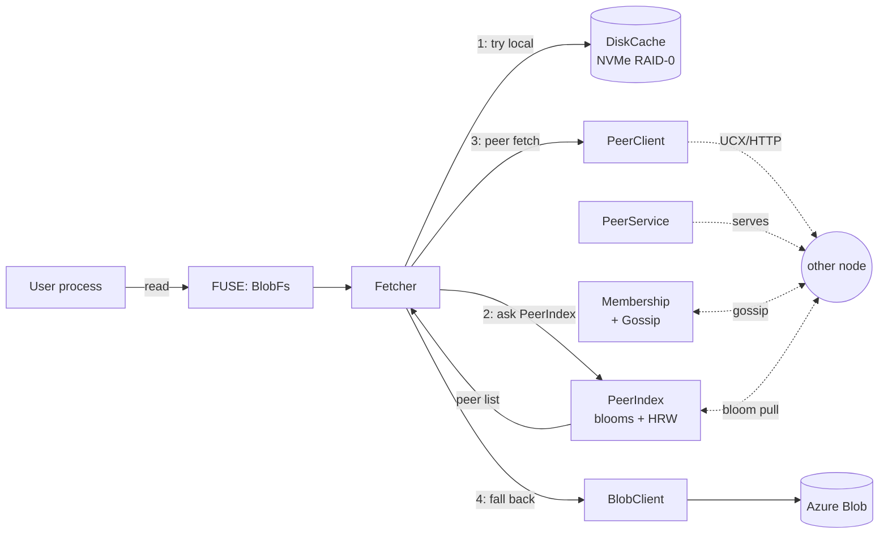
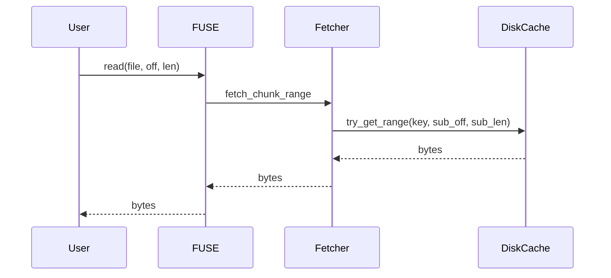

# blobcache — cache design

A high-level walkthrough of how the distributed cache works, focused on
the read path. Companion to `BENCHMARKS.md` (numbers) and `README.md`
(deployment).

## What it is

Each node in the cluster runs an identical daemon that:

1. mounts one or more Azure Blob containers as read-only filesystems via FUSE,
2. backs reads with a local NVMe chunk cache,
3. asks **peer nodes** for cache misses before falling back to Azure.

Goal: when 17 GPU nodes all read the same 400 GB model tree, the cluster
issues **one** Azure GET per chunk, not seventeen, and the warm reads
flow at NVMe + InfiniBand line rate.

## The pieces



Three TCP/UCX listeners per pod:

| Port | Purpose |
|---|---|
| 7771 | Gossip (membership + cluster-config + bloom-version) |
| 7772 | Peer chunk transport (TCP HTTP/1.1 or UCX over InfiniBand) |
| 7773 | Stats, metrics, control endpoints (`/hydrate`, `/clear-cache`, `/peers`, `/metrics`) |

## Storage layout

Cache is keyed by `(mount, blob_path, chunk_offset)`. The key is hashed
with SHA-256 to produce a flat-directory filename on the NVMe RAID-0
volume. There are no subdirectories; the disk just contains millions of
fixed-size chunk files.

Chunk size is **cluster-wide** (currently 4 MiB) and is part of the
`cluster_hash`. Nodes whose chunk size disagrees refuse to gossip-merge,
so the on-disk layout and peer-fetch keys cannot drift between nodes.

Eviction is LRU by access timestamp tracked in a `BTreeMap`. The cache
exposes `try_get_range(key, sub_offset, sub_len)` so a 128 KiB FUSE
sub-read costs one 128 KiB pread, not a full 4 MiB chunk read — a fix
that removed a 32× read amplification we hit early.

## Membership and gossip

Every 1.5 s each node picks a random peer and exchanges its full
membership view. Each `NodeInfo` carries:

- node id, gossip URL, transport URL, optional UCX worker address
- `cluster_hash` (chunk_size + sorted mount list)
- `incarnation` counter — bumped on self-refute when wrongly suspected
- `bloom_version` — see next section

States are `Alive` → `Suspect` → `Dead`, with a 30 s heartbeat timeout
to Suspect. Adequate for ~20-node clusters; not Serf-grade.

When a node transitions to `Dead`, an `on_peer_dead` hook fires and the
PeerIndex immediately drops that peer's bloom — so we don't keep routing
fetches to a node that is gone.

## Bloom filters: the "who has what" question

Every node maintains a Bloom filter of every chunk key it currently
holds on disk. Properties:

- **8 million bits** (1 MiB serialised), 4 hash functions per key
- inserted into on every `cache.insert()` (`note_local_insert`)
- periodically rebuilt from a fresh disk scan to compensate for
  evictions (a Bloom can't delete)
- versioned: every insert bumps the version monotonically

The version travels in the gossip payload. A separate **bloom-pull
loop** notices when a peer's advertised version is newer than the bytes
we hold for that peer and pulls the new bloom from `/cluster/bloom`.
Pull-based, not push-based, so receivers throttle and a flood of inserts
on one node doesn't fan out gossip storms.

This is the answer to "do we need a round-trip to discover who has a
chunk?" — **no**. Every node has a (slightly stale) summary of every
other node's contents, locally. Asking "does peer X probably have chunk
Y?" is four memory loads.

### What you get back

When the fetcher needs a chunk, `PeerIndex::rank_candidates` returns
two ordered lists:

- **YES** — peers whose bloom locally tests positive for this chunk
- **MAYBE** — peers we don't have a bloom for yet (just-joined; bloom
  pull hasn't completed their first sync)

Each list has its own attempt budget. Without separate budgets, a flood
of false-positives in YES could starve the MAYBE budget — meaning a
chunk that genuinely exists only on a just-joined node would never be
asked for, and we'd fall through to Azure unnecessarily.

False positives waste one peer probe (the peer responds "miss" and we
move on). False negatives would be catastrophic (we'd skip a peer that
actually has it and stampede Azure), so the data structure is biased
that way intentionally.

## HRW: when nobody has it

Bloom answers the warm question. For the cold question — "no peer says
they have this chunk; what now?" — we use **Highest Random Weight**
hashing, also called **Rendezvous hashing**:

```
score(peer_id, chunk_key) = SHA-256(peer_id || sha256(chunk_key))[:8] as u64
HRW-top(chunk_key) = peer with max score among all alive nodes (incl. self)
```

Every node computes the same score function locally, so they all agree
who is HRW-top for any given chunk without coordinating.

Compared to consistent hashing: no virtual nodes needed, simpler, same
property of only re-shuffling 1/N keys when membership changes. The
trade-off is per-key cost is O(N) instead of O(log N), which doesn't
matter at our scale.

**HRW is only consulted on cold misses**, not for normal routing. It
elects a single Azure-puller per chunk; see next.

## The stampede leader: avoiding cold-cache thundering herds

Setup: 17 cold pods open the same model file. Each pod's FUSE issues a
read for chunk 0. None of them has it, none of their peers' blooms
claim it. Naive design: 17 pods × 1 Azure GET = 17 GETs for the same
4 MiB chunk. Azure throttles, you get 503s, performance collapses.

The fix:

1. After all bloom YES/MAYBE attempts return miss, the fetcher computes
   `HRW-top(chunk_key)`.
2. If I am NOT HRW-top, I send a peer-fetch to HRW-top with a `wait_ms`
   parameter (e.g. 5000 ms).
3. The HRW-top pod's `PeerService` checks its local cache. If miss, it
   becomes the **stampede leader** for this chunk: it kicks off the
   Azure GET *and* puts an entry in its own per-node singleflight map.
4. Followers' requests arrive at HRW-top while the Azure GET is in
   flight; they **piggyback on the singleflight broadcast channel**
   instead of issuing their own Azure GETs.
5. When the Azure GET returns, the leader writes the chunk to its own
   cache (which inserts into its bloom, version bumps, peers learn it
   has the chunk on the next pull) and broadcasts the bytes to every
   follower waiting on the channel.
6. If `wait_ms` expires without leader getting the chunk, followers
   fall through to Azure themselves. (Last-resort safety valve. In a
   healthy cluster this rarely fires.)

End result: **one Azure GET per chunk per cold-cache event**, regardless
of how many concurrent readers there are.

This is also why "go to a specific node for a specific file" looks true
when you watch traffic. It's only true on the cold path, and only for
the brief moment before that chunk lands on disk and the bloom propagates.
Once the bloom propagates, the warm path takes over and routing is
fully distributed.

## Singleflight (per-node)

Inside one pod, the same chunk can be requested by multiple FUSE
threads simultaneously. The fetcher keeps an `inflight` map:

- First requester for a key creates a `tokio::broadcast::channel`,
  becomes the **leader**, executes `do_fetch`.
- Subsequent requesters subscribe to the channel and wait.
- Leader sends the result; everyone receives one copy.

A `LeaderGuard` ensures the inflight slot is cleared and followers are
notified even if `do_fetch` panics or the future is cancelled
(important under FUSE timeout cancellations).

This is a per-pod thing; stampede coordination is the cluster-wide
analogue.

## Read scenarios

### Scenario A — warm local hit



Cost: one pread on NVMe. ~50-200 µs. No network.

### Scenario B — warm peer hit (the common path)

Node A wants chunk K. Node B has it; B's bloom (which A holds locally)
contains K.

```mermaid
sequenceDiagram
  participant A as Node A
  participant B as Node B
  participant Az as Azure
  A->>A: cache miss
  A->>A: PeerIndex.rank_candidates(K)<br/>→ YES=[B], MAYBE=[]
  A->>B: peer_fetch(K, wait_ms=0)<br/>via UCX or HTTP
  B->>B: cache hit
  B-->>A: bytes
  A->>A: cache.insert(K, bytes)<br/>note_local_insert(K)
  Note over A,B: A's bloom now contains K too;<br/>next bloom pull will surface this
  Note right of Az: zero Azure traffic
```

Cost: one peer round-trip (UCX: ~200 µs latency + bandwidth-bound;
TCP: ~1-2 ms latency + bandwidth-bound). One disk write at A.

### Scenario C — cold cluster-wide (the stampede case)

All 17 nodes want the same chunk. Nobody has it. HRW elects node H.

```mermaid
sequenceDiagram
  participant A as Node A<br/>(not HRW-top)
  participant H as Node H<br/>(HRW-top)
  participant Az as Azure
  participant Fol as Other 15 followers

  par All nodes start
    A->>A: cache miss; bloom NO across all peers
    H->>H: cache miss; bloom NO across all peers
    Fol->>Fol: cache miss; bloom NO across all peers
  end

  par Followers route to leader
    A->>H: peer_fetch(K, wait_ms=5000)
    Fol->>H: peer_fetch(K, wait_ms=5000)
  end

  H->>H: I am HRW-top → leader
  H->>Az: GET chunk K
  Note over H,Az: ~50-200 ms first byte<br/>(Azure latency)
  Az-->>H: bytes
  H->>H: cache.insert; broadcast to followers

  par Followers wake up
    H-->>A: bytes
    H-->>Fol: bytes
  end

  Note over A,Fol: All nodes now have K cached;<br/>their blooms will pick it up<br/>on next rebuild/insert
```

Cost: **one** Azure GET cluster-wide + 16 peer round-trips + 16 disk
writes. Followers' wall time = Azure latency + Azure bandwidth +
peer-serve latency.

This is the core design payoff. Without it: 17 Azure GETs, throttling,
chaos.

### Scenario D — sequential prefetch (the production-warm case)

Production reads are almost never single chunks; they're long sequential
sweeps (model load, dataset stream). The fetcher detects this:

- Per `(mount, blob)` it tracks "consecutive forward read count".
- Once that exceeds `prefetch_threshold` (default 1), it spawns
  background fetches for the next `prefetch_depth` chunks (default 4)
  — guarded by a `prefetch_concurrency` semaphore so a thousand files
  in flight don't blow the runtime.
- Each prefetch goes through the normal `fetch_chunk` path (peers
  first, stampede if cold), so prefetch on cold caches uses scenario
  C and prefetch on warm uses scenario B.

The combined effect during a cold-cache PASS1 with 17 nodes reading the
same tree:

- All 17 nodes prefetch 4 chunks ahead.
- That's ~68 chunks "in the air" cluster-wide.
- Each chunk has a different HRW-top owner, so the **Azure pulls
  themselves spread across all 17 nodes**.
- By the time any FUSE read pointer arrives at chunk N, chunk N is
  already cached locally (from the prefetcher) or in-flight from a
  peer.

Removing prefetch from 16 of 17 nodes (the "origin-only" experiment in
`BENCHMARKS.md` Run #7) collapses this pipeline: 16 nodes are reduced
to on-demand cold-path stampede, paying scenario-C latency on every
chunk instead of having scenario A waiting for them.

### Scenario E — hydrate (a deliberately different path)

Hydrate is the "warm the cluster from cold" operation: a coordinator
shards the file list across all live nodes by HRW, and each shard
fetches its chunks **directly from Azure**, bypassing the peer/stampede
machinery via `fetch_chunk_origin_only`.

Why bypass it? When the entire cluster is uniformly cold:

- Asking peers is pointless (nobody has anything).
- The bloom-NO-stampede-leader path adds `wait_ms` of dead time per
  chunk, because the would-be leader is itself fetching its own shard
  and won't have the requested chunk for many seconds.
- Cache-insert + bloom-update still fire normally, so subsequent FUSE
  reads find chunks via the normal peer path.

Hydrate at 24 GiB/s aggregate, 16 s for 413 GB → it's purely Azure-
bandwidth-bound, not peer-bound, on this hardware.

## Worst cases and where the design strains

### 1. Stampede serialisation latency

The cold-path stampede converts what could be 17 parallel Azure GETs
into 1 leader + 16 waiters. Aggregate Azure bandwidth utilisation per
chunk drops from "17 nodes pulling" to "1 node pulling". For a single
hot chunk this is fine because Azure-per-blob bandwidth caps out at
around 60 MB/s anyway. For a workload of many cold chunks it is also
fine because *different* chunks have different HRW-top owners and the
Azure load fans out across the cluster.

It strains when the Azure pull is genuinely slow on the elected
leader (transient throttle, slow VM, network blip). All 16 followers
sit at `wait_ms` and time out together.

### 2. Bloom propagation lag

Insert-driven version bump → gossip carries the version → bloom-pull
loop on each peer notices and pulls bytes. Total propagation
~bloom_pull_secs (default a few seconds). A chunk just cached on node A
is invisible to node B until B pulls A's new bloom. During that gap, B
cold-misses the chunk and hits scenario C — even though A already has
it.

In a steady-state hot cluster this is invisible; on bursty cold-warm
transitions it can cause unnecessary stampede activity.

### 3. Bloom false-positive ceiling

At 8M bits, k=4, ~25k chunks (100 GiB cache @ 4 MiB), false-positive
rate is fractions of a percent — invisible. At ~250k chunks (1 TiB
cache) the rate climbs to single-digit percent: a few percent of peer
probes will be wasted round-trips to peers that don't actually have
the chunk. The fix would be to size the bloom to cache capacity, but
the cost is O(cache_size_in_chunks) bits per peer per cluster member;
keeping it constant at 1 MiB is a deliberate trade.

### 4. HRW skew on hot prefixes

For very hot files (e.g. a config file every node reads at startup),
all chunks of that file have *different* HRW-top owners — but the file
header (first few chunks) is read by all 17 nodes simultaneously, and
those few chunks have specific owners. Those 1-3 nodes briefly absorb
all the Azure-pull and peer-serve load for the file.

In practice this is bounded by the prefetch pipeline saturating the
peer-serve link before it becomes a real bottleneck; it shows up as
modest tail-latency spread (1.05× ratio in our 17-node runs), not as
a hot-spot collapse.

### 5. Single-stream warm-peer ceiling

Documented in `README.md` under Known limitations: ~3.55 GiB/s for one
`dd`-style reader, ~11.75 GiB/s aggregate across 8 streams per pod.
The ceiling is the daemon's single tokio worker driving the UCX
progress engine, not the fabric. Lifting it requires per-NIC progress
threads, out of scope for the v2.x line.

### 6. Origin-only prefetch (the run #7 anti-result)

Setting `transport.prefetch_origin_only = true` restricts prefetch to
the pod that most recently fetched a given file's chunks from Azure.
The intuition was "non-origin pods doing peer-only reads shouldn't
waste effort prefetching". The reality is that **prefetch is what
gets chunks into peers in the first place** during a cold burst.
With it disabled on 16 of 17 pods, those pods fall onto scenario C
(cold stampede) for every chunk instead of scenario B (warm peer).
Cold PASS1 wall time went from 327 s to 2221 s (6.8× slower). PASS2
warm was unaffected (chunks already local; prefetch short-circuits on
cache-hit anyway).

The flag is correct for workloads where pods read **disjoint** file
sets (each pod is genuinely the only reader of its files). It is
wrong for the all-pods-read-same-tree GPU-training pattern, which is
the dominant case.

## Implementation choices, called out

- **Bloom over an exact index.** Fixed 1 MiB per peer, never grows.
  Exact index would scale linearly with cache size (millions of keys
  per peer) and eat both memory and gossip bandwidth. False positives
  are cheap (one wasted peer probe); false negatives would be
  catastrophic (we'd silently skip a peer that has the chunk and
  stampede Azure). Bloom biases the failure mode the right way.

- **HRW over consistent hashing.** Identical churn properties, no
  virtual-node bookkeeping, two-line implementation. We don't have
  enough nodes for the O(N) lookup cost to matter.

- **Pull-based bloom sync.** Receivers throttle, peer churn doesn't
  cause gossip storms. The trade is propagation latency
  (~bloom_pull_secs) which we accept as the price of stability.

- **Two-level dedup**: per-node singleflight + cluster-wide stampede
  leader. The two interact cleanly because the cluster-wide leader
  hits its own per-node singleflight when serving followers.

- **Direct-Azure bypass for hydrate.** When the whole cluster is
  uniformly cold, peer routing is pure overhead. The bypass costs us
  a code path but saves several seconds per chunk in the only
  workload where it matters.

- **Cluster-wide chunk size in the cluster hash.** Prevents two nodes
  with different chunk sizes from accidentally peering — their disk
  layouts and peer-fetch keys would silently disagree. Hard guard at
  gossip merge time rather than soft validation later.

## When to read what next

- Numbers and tuning history → `BENCHMARKS.md`
- Deployment, ports, RBAC → `README.md`
- The actual experiment that produced this doc → `BENCHMARKS.md` Run #7
