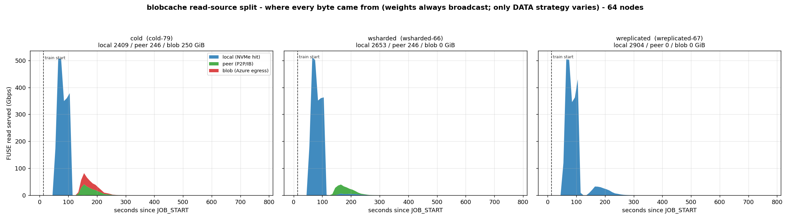
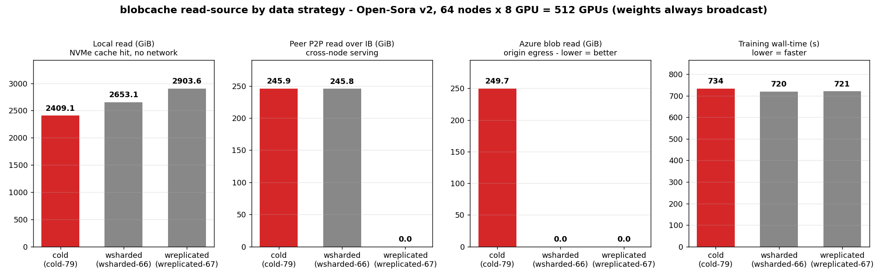
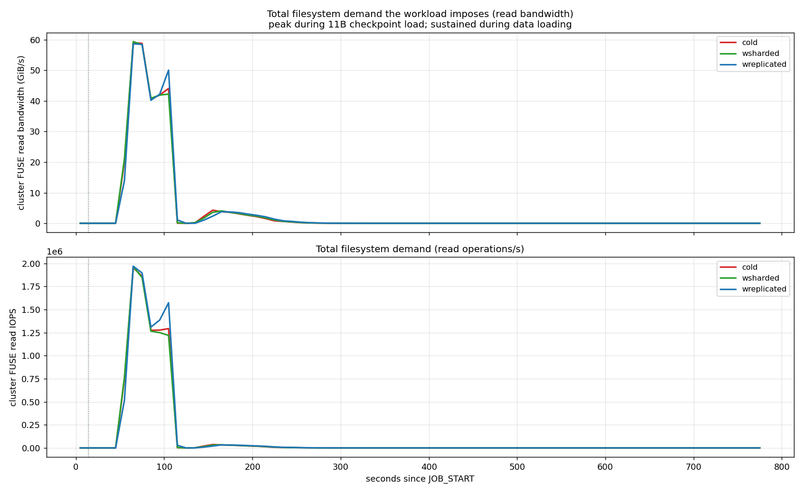
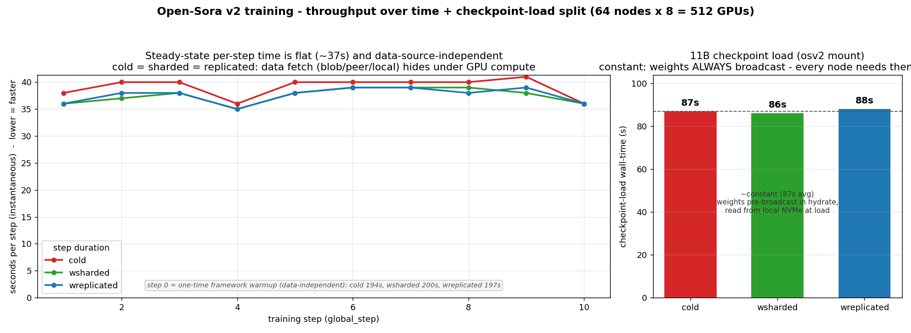
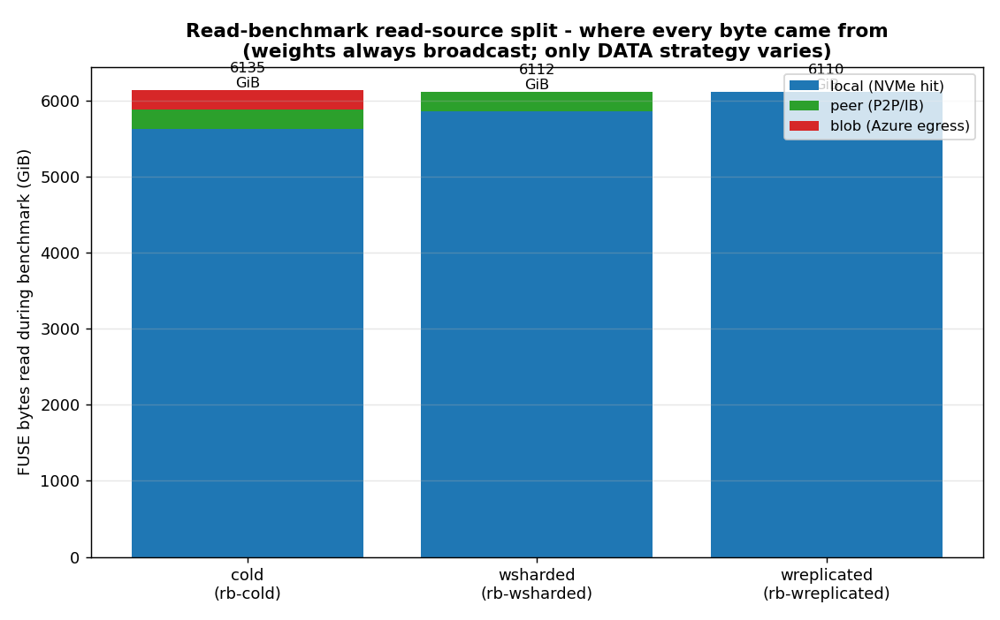
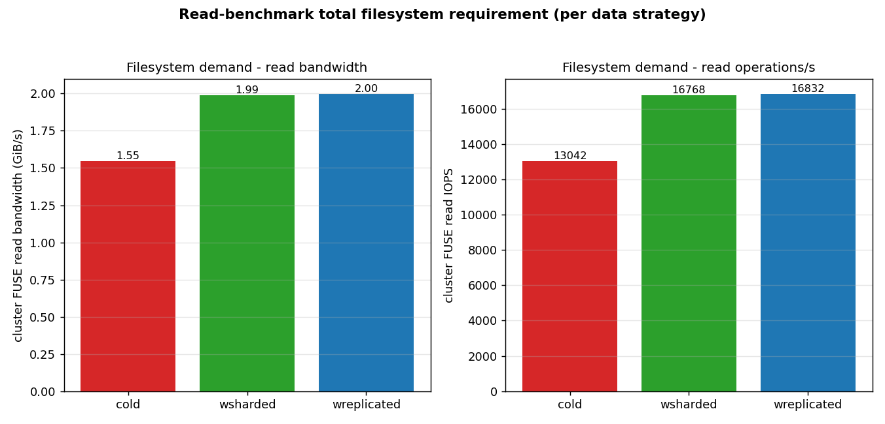

# Open-Sora v2 × blobcache — 64-node / 512-GPU Data-Strategy Benchmark

Real Open-Sora v2 (11B DiT + Hunyuan VAE + T5 + CLIP) training on **64 NDv5 H200
nodes (512 GPUs)** with the Pexels video dataset streamed from Azure Blob through
**blobcache** — a FUSE mount backed by a local NVMe cache and node-to-node
peer-fetch over InfiniBand. Every number below comes from real runs: the actual
`train.py` for the training experiment, and a real DataLoader iterating real
decoded video for the read-benchmark.

> **The experiment varies exactly one thing: the *data* caching strategy.** The
> 11B checkpoint is **always broadcast** to every node (every data-parallel rank
> needs the full set of weights to start), so checkpoint load is held *constant*
> as a control. What changes between runs is whether the *dataset* is cold,
> sharded across nodes, or replicated to every node.

> **Scripts:** every artifact that produced these numbers lives in
> [`examples/open-sora/`](../../examples/open-sora/). This guide assumes blobcache
> is already installed and running cluster-wide — see [`slurm.md`](../slurm.md) for
> the one-time install (and [azcluster](https://github.com/edwardsp/azcluster) for
> provisioning the cluster itself).

---

## 1. TL;DR — five findings

1. **Training step time is data-source-independent.** Past a one-time framework
   warmup (step 0 ≈ 194–200 s, `torch.compile`/CUDA-graph capture, identical for
   every run), steady-state per-step time is a flat **~37 s/step** whether the
   dataset is cold, sharded, or replicated. blobcache's peer-fetch over IB fully
   hides Azure and cross-node latency at this compute intensity. Training
   wall-times land within ~1.8 %: **cold 733.7 s, sharded 720.5 s, replicated
   721.2 s.**

2. **Every strategy pays the same one-time Azure egress — warm just moves it
   earlier.** A fresh cache must pull the dataset from Azure once (~250–258 GiB)
   regardless of strategy; the **0 blob** in the warm *training* window is a
   measurement artifact — that pull already happened, in the separately-timed
   hydrate phase (§3.6). Cold streams it live during training (249.7 GiB from
   blob, plus another 245.9 GiB of redundant cross-node touches that blobcache
   served peer-to-peer over IB instead of re-hitting origin). Warm-sharded and
   warm-replicated pull that same ~one dataset during hydrate. Pre-hydration does
   not *avoid* egress — it relocates it out of the training window. True zero
   egress only comes from **reusing** a warm cache across many jobs.

3. **The filesystem demand is real and large — we did not invent a solution for
   nothing.** During training the cluster sustains a peak aggregate read rate of
   **~59 GiB/s (≈0.5 Tbps)** and **~1.95 million IOPS** across the 64 nodes
   (~0.92 GiB/s and ~30 k IOPS per node). blobcache serves that from local NVMe +
   IB peer-fetch; a central shared filesystem would have to deliver it from one
   place. A read-only DataLoader stress (§4) re-reads the dataset ~24× and
   confirms the same source-split under heavier I/O.

4. **Checkpoint load is constant (~87 s) — the control held.** Because weights
   are always broadcast, every node reads the full checkpoint from local NVMe at
   model-load. Measured load: **cold 87 s, sharded 86 s, replicated 88 s.** The
   data strategy does not move it; it is not part of the story, by design.

5. **Hydrate is pure up-front overhead for a single pass — and cold skips it.**
   Hydrate (weights always broadcast): **cold ~27 s** (weights only),
   **sharded ~49 s**, **replicated ~140 s** — and replicated needs **4.7× more
   disk per node** (322.9 vs 68.4 GiB). Since all three pull the dataset from Azure
   exactly once (§3.7), that extra 22–113 s of *data* hydrate buys nothing for a
   one-off run — cold finishes first end-to-end. Pre-hydration pays off only across
   cache reuse / multiple epochs; when it does, **shard, don't replicate**.

| Strategy (data) | Azure egress¹ | Hydrate | Train wall | **E2E (hydrate+train)** | Disk/node |
|---|---|---|---|---|---|
| **Cold** (stream on demand) | ~250 GiB — live, in training | ~27 s | 733.7 s | **~761 s** | 64.4 GiB + live |
| **Warm-sharded** (1/N + peer) | ~258 GiB — up-front, in hydrate | ~49 s | 720.5 s | **~770 s** | **68.4 GiB** |
| **Warm-replicated** (full copy) | ~258 GiB — up-front, in hydrate | ~140 s | 721.2 s | **~861 s** | 322.9 GiB |

¹ Fresh cache: all three pull the dataset from Azure ~once. Cold pays it live during
training; warm pays it up-front during hydrate. **None is zero-egress for a single
run** — warm reaches true zero only when a pre-warmed cache is *reused across jobs*.

**For this single-epoch run, cold wins** — same egress as warm, fastest end-to-end
(~761 s), no hydrate to orchestrate. **Always broadcast the weights; shard the data
only once a warm cache is reused across jobs or epochs** (§3.7), where the up-front
hydrate amortizes into zero per-job egress.

---

## 2. Experimental design

Three runs, identical in every way except the **dataset** cache state at
`TRAIN_START`. Same cluster, same config
(`configs/diffusion/train/blobcache_stage1.py`), same dataset (18 319 Pexels
samples, 258.5 GiB), same 1 epoch / 11 optimizer steps, same
`--nodes=64 --nodelist=node-[0002-0006,0008-0066]` (node 0007 drained).

| Run | `RUN_ID` | Job | Weights | Dataset at `TRAIN_START` |
|---|---|---|---|---|
| **Cold** | `cold-79` | 79 | broadcast (every node) | empty — streams from Azure on first touch |
| **Warm-sharded** | `wsharded-66` | 66 | broadcast (every node) | `default`/round-robin: each node holds ~1/64 (~4 GiB), peer-fetches the rest over IB |
| **Warm-replicated** | `wreplicated-67` | 67 | broadcast (every node) | `broadcast`: every node holds a full 258.5 GiB copy |

**Invariant (control):** the checkpoint is **broadcast in all three runs** — every
DP rank reads the full 11B model before step 0, so the only sane layout is a full
copy on every node. Sharding the checkpoint was rejected in earlier work because
it makes 63 of 64 nodes peer-fetch missing weights at model-load, a fetch storm
that buys nothing.

**Variable:** the dataset caching strategy (cold / sharded / replicated).

**Controls applied to every run:**
- Cache cleared **bloom-aware** (coordinator `POST /clear-cache`, not raw `rm`)
  before each run, so peer-advertisement bloom filters stay truthful.
- A **60 s idle gap** between hydrate and `TRAIN_START` so hydrate traffic never
  contaminates the training metrics window.
- A per-node `/metrics` sampler writes one CSV per node; phase markers
  (`JOB_START → STAGE_* → TRAIN_START → TRAIN_DONE → JOB_END`) bracket the window.

The single scale knob is `#SBATCH --nodes=N`; everything below ran at N=64.

A second, independent experiment — a **read-benchmark** (§4) — repeats the same
three data strategies under a pure DataLoader stress (200 steps, ~24× re-read of
the dataset, no model) to isolate the I/O path from GPU compute.

---

## 3. Training results

### 3.1 Read-source split — where every byte came from

This is the headline the rest of the report supports: with weights held constant,
*where the data is read from* is the only thing that changes.



Cluster-wide FUSE read rate vs time, decomposed by source. **Cold** shows the big
blue local spike (cache fills, then re-reads hit NVMe) plus a **red Azure-blob**
hump *and* a **green peer** hump at ~150–250 s — the first-touch misses, served
~half from origin and half from peers. **Warm-sharded** has the green peer hump
but **no red**. **Warm-replicated** is **pure blue** — everything local.



| Run | Local (NVMe) | Peer (P2P/IB) | Blob (Azure) | Total FUSE | Local % | Peer % | Blob % |
|---|---|---|---|---|---|---|---|
| Cold | 2409.1 GiB | 245.9 GiB | **249.7 GiB** | 2904.7 GiB | 82.9 | 8.5 | 8.6 |
| Warm-sharded | 2653.1 GiB | 245.8 GiB | **0** | 2898.9 GiB | 91.5 | 8.5 | 0 |
| Warm-replicated | 2903.6 GiB | ~0 | **0** | 2903.6 GiB | 100 | 0 | 0 |

(Local = total − peer − blob; columns sum to the total FUSE read.) The warm runs
show **0 blob during training** — but only because the dataset was already pulled
from Azure during *hydrate* (§3.6); the zero is a property of the measurement
window, not evidence that egress was avoided. The cold run makes visible the egress
**everyone pays once**: **249.7 GiB of Azure reads**, plus 245.9 GiB of redundant
cross-node first-touch misses that blobcache served peer-to-peer over IB rather than
re-hitting origin (so peer-fetch roughly *halved* what a naive per-node streamer
would have pulled). Cold simply pays that one dataset live, inside the training
window — which is also its only real risk: a throttling-prone live-fetch phase
overlapping the expensive GPU time.

### 3.2 Filesystem demand — IOPS and bandwidth

The point of blobcache is to serve a filesystem load that a central store would
struggle with. Measured aggregate demand across the 64 nodes during training:



| Run | Peak read bandwidth | Peak IOPS | Total read ops |
|---|---|---|---|
| Cold | 59.1 GiB/s (≈0.50 Tbps) | 1.95 M | 86.3 M |
| Warm-sharded | 59.4 GiB/s (≈0.50 Tbps) | 1.96 M | 85.4 M |
| Warm-replicated | 58.7 GiB/s (≈0.49 Tbps) | 1.97 M | 89.0 M |

Per node that is **~0.92 GiB/s and ~30 k IOPS** at peak. blobcache delivers it
from local NVMe (replicated), or NVMe + IB peer-fetch (sharded), or NVMe + IB +
Azure (cold) — transparently, behind one FUSE mount. The peak is the same in all
three because the *workload* (what the GPUs demand) is identical; only the
*fulfilment path* differs.

### 3.3 Checkpoint load — the invariant



Right panel: checkpoint-load wall-time, measured from rank-0
`Loading checkpoint …Open_Sora_v2.safetensors` → `Beginning epoch 0…`.

| Run | Checkpoint load |
|---|---|
| Cold | 87 s |
| Warm-sharded | 86 s |
| Warm-replicated | 88 s |

**Constant within ±1 s.** Weights are broadcast in every run, so model-load always
reads the full ~64 GiB checkpoint from local NVMe (~0.74 GiB/s/node). This is the
control: it confirms the only thing the data-strategy variable moves is the *data*
path, not the model path.

### 3.4 Per-step throughput — data-independent

Left panel of the figure above: **instantaneous** per-step duration (steps 1–10;
step 0 is the one-time framework warmup, annotated). The three runs overlap at
**~36–40 s/step**. The DataLoader prefetches the next batch while the GPU works the
current one, so as long as data delivery supplies one batch per ~37 s step, the
*source* (local / peer / blob) is invisible to wall-time.

> **Caveat on s/it:** tqdm's *reported* s/it is a cumulative running average
> dominated by step 0, so it "ramps down" for every run regardless of cache state
> — an averaging artifact, not cache warming. We plot instantaneous step duration
> (delta of the elapsed clock between consecutive `global_step`s) instead.

### 3.5 Correctness — loss is identical across runs

The I/O path must not change the math. Per-step loss from all three rank-0 logs:

| step | cold-79 | wsharded-66 | wreplicated-67 |
|---|---|---|---|
| 0 | 0.0614 | 0.0614 | 0.0614 |
| 1 | 0.0646 | 0.0646 | 0.0646 |
| 2 | 0.119 | 0.119 | 0.119 |
| 3 | 0.0584 | 0.0584 | 0.0584 |
| 4 | 0.106 | 0.106 | 0.106 |
| 5 | 0.0798 | 0.0799 | 0.0798 |
| 6 | 0.0665 | 0.0665 | 0.0665 |
| 7 | 0.076 | 0.076 | 0.076 |
| 8 | 0.124 | 0.124 | 0.124 |
| 9 | 0.0957 | 0.0958 | 0.0957 |
| 10 | 0.107 | 0.107 | 0.107 |

**Max spread = 0.0001**, at two steps, in the last displayed digit (`wsharded-66`
reads 0.0799/0.0958 where the other two read 0.0798/0.0957). `cold-79` and
`wreplicated-67` are bit-identical; the sharded deviation is ordinary
all-reduce floating-point non-determinism and is **independent of the data
strategy**. `global_grad_norm` matches to the same precision. The blobcache layout
does not change training results.

### 3.6 Hydrate cost — the up-front tradeoff

Hydrate runs before the job is submitted, through the blobcache admin API. It is
the main place the three strategies differ in cost. Measured (weights always
`broadcast`; from the orchestrator logs):

| Run | Clear cache | Weights (broadcast) | Data hydrate | Total hydrate | Disk / node |
|---|---|---|---|---|---|
| Cold | 31.4 s | 27.4 s | none (streams live) | **~27 s** | 64.4 GiB + live |
| Warm-sharded | 9.5 s | 29.5 s | 19.4 s (`default`/shard) | **~49 s** | **68.4 GiB** |
| Warm-replicated | 9.4 s | 28.3 s | 111.2 s (`broadcast`) | **~140 s** | 322.9 GiB |

The data-hydrate throughput tells the story: sharding the 258.5 GiB dataset
completes at an **aggregate 13.3 GiB/s** (each node pulls a disjoint ~1/64 from
origin in parallel — no redundant reads), while broadcasting it runs at **1.9
GiB/s** (every chunk must reach every node). So sharded data-hydrate runs at
**~7× the aggregate throughput**, finishes the data copy in **19 s vs 111 s**, and
costs **4.7× less disk** than replicated — for the same training wall-time.

### 3.7 End-to-end time & egress — cold wins this benchmark

Train wall excludes hydrate (separate job, §2). Add it back for the honest cost of
one run on a fresh cache (clear-cache is a benchmark *reset*, not a per-job cost, so
it's excluded):

| Strategy | Azure egress (one dataset) | Hydrate | Train wall | **End-to-end** |
|---|---|---|---|---|
| **Cold** | ~250 GiB — live, during training | ~27 s (weights only) | 733.7 s | **~761 s** |
| **Warm-sharded** | ~258 GiB — up-front, during hydrate | ~49 s | 720.5 s | **~770 s** |
| **Warm-replicated** | ~258 GiB — up-front, during hydrate | ~140 s | 721.2 s | **~861 s** |

**For this configuration — a single epoch over a fresh cache, compute-bound — cold
is the best strategy.** All three pull the dataset from Azure exactly once, so the
egress is a wash. The warm strategies add a 49–140 s hydrate whose *only* job is to
move that one pull earlier — and for a single pass that buys nothing: blobcache's
prefetch already hides cold's live streaming behind the ~37 s steps, so cold's whole
"penalty" is the ~13 s of extra train wall (733.7 vs ~721 s) — far less than the
hydrate it skips. Cold finishes first **and** is the simplest to operate.

**When warm-sharded pays off instead** (none of which apply to this run):
- **The cache is reused across many jobs.** Hydrate once, then every *subsequent*
  job sees a warm cache and **true zero Azure egress** — the up-front pull amortizes.
  This, not any single run, is the real "zero-egress" story.
- **Multi-epoch or I/O-bound training**, where a slower first touch would stall the
  GPUs. Here the model is compute-heavy enough that the source is invisible; a
  lighter model would expose cold's first-epoch streaming.
- **You must isolate origin egress** from the GPU window (throttling-sensitive
  pipelines, hard egress SLAs) — cold's live pull overlaps the expensive 512-GPU
  phase, where an Azure throttle would idle the cluster.

Even then the rule is **shard, never replicate**: replicated costs 4.7× the disk and
~3× the hydrate for identical training speed.

---

## 4. Read-benchmark — corroboration under heavier I/O

To isolate the I/O path from GPU compute, a second experiment runs the **real
DataLoader only** (decode + collate, no model) for 200 steps across all 64 nodes —
**~24× of re-read amplification** (~6.0 TiB of total FUSE reads over the 258.5 GiB
dataset). Same three data strategies, same bloom-aware clear before each.




| Scenario | Total FUSE | Local | Peer | Blob | Local % | Sust. agg. BW | Agg. IOPS |
|---|---|---|---|---|---|---|---|
| Cold | 6135.0 GiB | 5620.1 GiB | 256.3 GiB | **258.5 GiB** | 91.6 | 1.55 GiB/s | 13 042 |
| Warm-sharded | 6111.5 GiB | 5855.0 GiB | 256.5 GiB | **0** | 95.8 | 1.99 GiB/s | 16 768 |
| Warm-replicated | 6110.4 GiB | 6110.4 GiB | 0 | **0** | 100 | 2.0 GiB/s | 16 832 |

Same conclusion as training, amplified: cold pulls **exactly one full pass of the
dataset from Azure** (blob 258.5 GiB ≈ the 258.5 GiB dataset) and serves a second
pass from **peers** (256.3 GiB); the remaining ~22× of reads hit local NVMe. The
warm runs show **0 blob here too — because they pulled that same one dataset from
Azure during hydrate beforehand**, not because they avoid it. Across 24 re-reads the
source split barely moves wall time (sharded 3072 s vs replicated 3060 s): the
sustained read rate is decode-bound, not source-bound. The lesson repeats — the
first pass costs one dataset of egress no matter what; only *cache reuse* across runs
drives it to zero.

> **Bandwidth caveat:** these read-bench bandwidth/IOPS figures are a **sustained
> aggregate average** over the full bracket *including* a straggler decode tail, so
> they understate the peak. The training experiment (§3.2) captures the
> instantaneous peak (~59 GiB/s aggregate). Both are real; they measure different
> things (sustained-average throughput vs peak demand).

---

## 5. Best Practices

1. **Always broadcast the checkpoint; never shard it.** Every data-parallel rank
   needs the full model before step 0, so the checkpoint is read in full by every
   node. Broadcasting it (~64 GiB/node, ~28 s hydrate) keeps model-load on local
   NVMe (~87 s, constant) and avoids a 63-way peer-fetch storm at startup. This is
   the one non-negotiable.

2. **For a single pass on a fresh cache, run cold.** Cold pulls the dataset from
   Azure exactly once — the same egress every strategy pays — but does it live,
   hidden behind compute, so it finishes end-to-end *fastest* (~761 s) with no
   hydrate to orchestrate (§3.7). Pre-hydrating a one-off run just adds 49–140 s of
   up-front latency to relocate an egress you pay anyway.

3. **Pre-hydrate to amortize across reuse — and then shard, don't replicate.**
   Hydration earns its keep when a warm cache is reused across many jobs (every later
   job then sees true zero egress) or for multi-epoch / I/O-bound training. When you
   do hydrate the data, round-robin (`default`) sharding matches full-replication
   training speed at **4.7× less disk/node** and **~3× shorter hydrate** (49 s vs
   140 s). Replicate (`broadcast`) only if IB is contended or the dataset is tiny.
   Either way, hydrate *before* you submit and leave a short idle gap so hydrate
   traffic doesn't pollute training metrics.

4. **Peer-fetch halves cold-start egress for free.** Even with no pre-hydration,
   blobcache served ~half of the cold first-touch misses from peers over IB
   (245.9 GiB peer vs 249.7 GiB blob). If you must run cold, you still pay roughly
   half the Azure egress a naive per-node streamer would.

5. **Measure the filesystem demand, and size for the peak.** This workload peaks at
   ~59 GiB/s and ~1.95 M IOPS aggregate (~0.92 GiB/s, ~30 k IOPS per node). Track
   it from the `/metrics` deltas; it is the number a central filesystem would have
   to meet and the reason node-local NVMe + IB peer-fetch exists.

6. **Don't trust tqdm's averaged s/it for I/O analysis.** Use instantaneous
   per-step duration. The averaged value ramps down for every run and will fool you
   into seeing "cache warming" that isn't there.

7. **Clear the cache bloom-aware.** Deleting cache files on disk without telling the
   daemon leaves the bloom filter advertising chunks the node no longer has, which
   corrupts peer-fetch. Always use the coordinator (`POST /clear-cache`), which fans
   out to all peers and updates the filters (verified: 17.8 TB / 4.8 M files across
   64 nodes cleared in 31 s).

8. **Verify correctness across cache states.** Loss and grad-norm must match (to
   display precision) cold vs sharded vs replicated. A divergence means the data
   path changed bytes, not just their source.

**Recommended default:** always broadcast the checkpoint. For a one-off / single-epoch
run, **go cold** — fastest end-to-end for the same egress. **Shard the dataset
(`warm-sharded`) once you reuse a warm cache across jobs or train multiple epochs**,
where the up-front hydrate amortizes into true zero per-job egress.

---

## 6. Playbook — run it yourself

Scripts live in [`examples/open-sora/`](../../examples/open-sora/); stage them to
shared NFS on the cluster (the commands below assume `/shared/blobcache-deploy/`).
The blobcache admin API (`/clear-cache`, `/hydrate`) is on port 7773 of every
compute node and is reachable cluster-internally, so run these from the login node
against any compute node `$ADMIN`:

```bash
ADMIN=<a-compute-node>            # coordinates clear-cache + hydrate fan-out
NODELIST='<your-64-node-list>'    # e.g. node-[0002-0006,0008-0066]
```

> **Shortcut:** [`run_all.sh`](../../examples/open-sora/run_all.sh) does all six
> runs (3 training + 3 read-bench) unattended —
> `ADMIN=$ADMIN NODELIST=$NODELIST /shared/blobcache-deploy/run_all.sh`. The steps
> below are the same sequence, run by hand.

### Prereqs (one-time)
- Dataset on blob, mounted at `/blobcache/pexels`; checkpoints at `/blobcache/osv2`
  (`Open_Sora_v2.safetensors`, `hunyuan_vae.safetensors`) — see
  [`blobcached.toml`](../../examples/open-sora/blobcached.toml).
- Container `os-train.sqsh`, repo `Open-Sora`, and `os-train.sbatch` staged in
  `/shared/blobcache-deploy/`. Copy `blobcache_stage1.py` into the checkout at
  `Open-Sora/configs/diffusion/train/blobcache_stage1.py`.
- Hydrate payloads on NFS: `hydrate-osv2.json` (weights, `"mode":"broadcast"`),
  `hydrate-pexels.json` (data, `broadcast`), `hydrate-pexels-shard.json`
  (data, `"mode":"default"`).

### Step 1 — clear the cache (bloom-aware)
```bash
curl -s -X POST "http://$ADMIN:7773/clear-cache" | jq
# → {total_files_removed, total_bytes_removed, elapsed_ms, peers:[...]}
```

### Step 2 — hydrate for the layout you want (weights ALWAYS broadcast)
```bash
# weights: broadcast in every scenario
curl -s -X POST "http://$ADMIN:7773/hydrate?async=1" \
     --data-binary @/shared/blobcache-deploy/hydrate-osv2.json

# data: choose ONE
#   warm-sharded (recommended):
curl -s -X POST "http://$ADMIN:7773/hydrate?async=1" \
     --data-binary @/shared/blobcache-deploy/hydrate-pexels-shard.json
#   warm-replicated:  --data-binary @/shared/blobcache-deploy/hydrate-pexels.json
#   cold:             skip the data hydrate entirely

# each returns {"job_id":...}; poll until status=completed:
curl -s "http://$ADMIN:7773/hydrate/<job_id>" | jq -r .status
```

### Step 3 — submit the training run
```bash
sbatch --nodes=64 --nodelist="$NODELIST" \
  --export=ALL,RUN_TAG=wsharded \
  /shared/blobcache-deploy/os-train.sbatch
# RUN_TAG ∈ {cold, wsharded, wreplicated} → labels CSVs + markers as <tag>-<jobid>
```
The sbatch starts a per-node `/metrics` sampler (one CSV/node), writes phase
markers, then runs `train.py` under enroot with `/blobcache` and `/shared` mounted.

### Step 4 — (optional) read-benchmark for the same strategy
```bash
# clear + hydrate as above (data only; no weights needed), settle, then snapshot
# /metrics, run the harness, and snapshot again:
NODES="$NODELIST" /shared/blobcache-deploy/snap_metrics.sh bench/rb-wsharded-before.csv
sbatch --nodes=64 --nodelist="$NODELIST" \
  --export=ALL,STEPS=200,WORKERS=8,BATCH=4 \
  /shared/blobcache-deploy/harness.sbatch
NODES="$NODELIST" /shared/blobcache-deploy/snap_metrics.sh bench/rb-wsharded-after.csv
```

### Step 5 — collect artifacts
Logs and metrics land under `/shared/blobcache-deploy/` on shared NFS:
```
os-train-<jobid>.out
metrics/<tag>-<jobid>.markers
metrics/<tag>-<jobid>-<host>.csv
bench/rb-<tag>-{before,after}.csv
```
Copy them to your analysis host (`scp`/`rsync` from the login node), preserving the
`metrics/` and `bench/` layout the plotters expect.

### Step 6 — plot (3-way)
From your repo checkout, with the collected `metrics/` and logs alongside:
```bash
M=metrics; L=results/64node
# read-source split + filesystem demand
python3 examples/open-sora/plot_reads.py --metrics-dir $M \
  --run cold=cold-79 --run wsharded=wsharded-66 --run wreplicated=wreplicated-67 \
  --out-prefix $L/reads-64node
# read-source bars + train wall
python3 examples/open-sora/plot_summary.py --metrics-dir $M \
  --run cold=cold-79 --run wsharded=wsharded-66 --run wreplicated=wreplicated-67 \
  --out-prefix $L/summary-64node
# per-step throughput + checkpoint-load split (takes LOG paths)
python3 examples/open-sora/plot_throughput.py \
  --run cold=$L/os-train-79.out --run wsharded=$L/os-train-66.out \
  --run wreplicated=$L/os-train-67.out --out-prefix $L/throughput-64node
# read-benchmark (before/after /metrics snapshots)
python3 examples/open-sora/plot_readbench.py --bench-dir $L/bench --out-prefix $L/readbench
```

### Step 7 — verify correctness
Confirm per-step `loss` / `global_grad_norm` match across runs (the
`throughput-64node.json` `series` arrays). Max spread should sit at the last
displayed digit; anything larger means the data path changed bytes.

---

## 7. Provenance

| Run | `RUN_ID` | Job | State | Train wall | Log | Metrics |
|---|---|---|---|---|---|---|
| Cold | `cold-79` | 79 | COMPLETED | 733.7 s | `results/64node/os-train-79.out` | `metrics/cold-79.*` |
| Warm-sharded | `wsharded-66` | 66 | COMPLETED | 720.5 s | `results/64node/os-train-66.out` | `metrics/wsharded-66.*` |
| Warm-replicated | `wreplicated-67` | 67 | COMPLETED | 721.2 s | `results/64node/os-train-67.out` | `metrics/wreplicated-67.*` |

Read-benchmark: `bench/rb-{cold,wsharded,wreplicated}-{before,after}.csv` →
[`results/64node/readbench.json`](../../examples/open-sora/results/64node/readbench.json).

- Cluster: 64× NDv5 H200 (8 GPU/node = 512 GPUs), InfiniBand fabric;
  nodelist `node-[0002-0006,0008-0066]` (0007 drained).
- Dataset: `zengxianyu/open-sora-pexels-full`, 18 319 samples, 258.5 GiB,
  75 196 chunks.
- Checkpoint: Open-Sora v2 (11B DiT + Hunyuan VAE + T5 + CLIP), ~64.4 GiB,
  broadcast to every node in all runs.
- Metrics CSV schema: `epoch_ms,host,blob_fetches,blob_bytes,peer_fetches,
  peer_bytes,cache_hits,cache_misses,cache_bytes,fuse_reads,fuse_read_bytes`;
  local = fuse_read − peer − blob, bandwidth = Δfuse_read_bytes/Δt,
  IOPS = Δfuse_reads/Δt.
- Scripts: [`examples/open-sora/`](../../examples/open-sora/) —
  `plot_{reads,summary,throughput,readbench}.py`, `os-train.sbatch`,
  `harness.sbatch`. Summarized metric JSONs the plots were rendered from are in
  [`results/64node/`](../../examples/open-sora/results/64node/).
